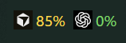
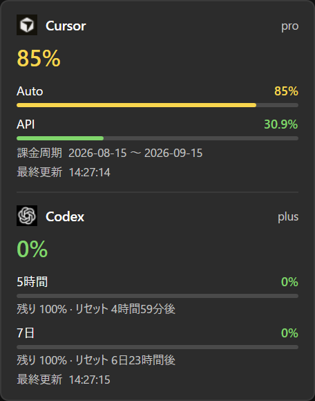

# AI Usage Bar

English | [日本語](README.ja.md)

Shows Cursor and Codex usage on the Windows 11 taskbar, just left of the notification area.



The bar shows icons and percentages only. Left-click opens details such as breakdown, reset time, and billing cycle. Right-click has Refresh, Settings, and Exit.



## Install

Download `AI-Usage-Bar-win-x64.zip` from [Releases](https://github.com/ham0806/ai-usage-bar/releases). Extract it and run `AI Usage Bar.exe`.

The UI follows the Windows display language (English or Japanese). Override it in Settings if needed.

## Requirements

- Windows 11
- .NET 8 SDK for development (`mise install dotnet@8`)
- For Codex: a working `codex login`
- For Cursor: a signed-in Cursor app, or the session token described below

## Run from source

```powershell
.\run.ps1
```

To see logs, or if the exe is not built yet:

```powershell
dotnet run --project src\AiUsageBar\AiUsageBar.csproj
```

A second launch exits instead of opening another instance. Exit from the widget's right-click menu.

To start with Windows, open Settings from the right-click menu and turn on **Start with Windows**.

## Build the exe

On a PC without .NET, you can still run the exe produced by `build.ps1`.

```powershell
.\build.ps1
```

Output: `dist\AI Usage Bar\AI Usage Bar.exe`. If you started from the exe, **Start with Windows** registers that exe.

Releases are published when a `vX.Y.Z` tag is pushed. GitHub Actions tests, builds the zip, and attaches it to the GitHub Release.

## Cursor auth

The app first reads `cursorAuth/accessToken` from `%APPDATA%\Cursor\User\globalStorage\state.vscdb`. If that is missing or returns 401, it uses the token pasted in Settings. Tokens are stored in Windows Credential Manager.

Paste the `WorkosCursorSessionToken` cookie from cursor.com. In Chrome: DevTools → Application → Cookies → `https://cursor.com`.

Cursor usage comes from the unofficial dashboard endpoint `GET https://cursor.com/api/usage-summary`, not an official API. It can break after product changes or when the session expires.

## Codex auth

Uses ChatGPT OAuth from `%USERPROFILE%\.codex\auth.json` (or `CODEX_HOME`). Near expiry it refreshes with the same JSON as the official CLI and writes back to `auth.json`. Endpoints: `https://chatgpt.com/backend-api/codex/usage` and `https://chatgpt.com/backend-api/wham/usage`. If those fail, it calls `account/rateLimits/read` on the installed `codex app-server` over JSON-RPC. Settings also has **Open codex login**. Tokens are not written to the log.

## Settings

`%LOCALAPPDATA%\ai-usage-bar\config.json` stores refresh interval, which providers to show, position offset, and language. It does not store secrets. Logs: `%TEMP%\ai-usage-bar.log`.

If the bar overlaps the notification area, move it with Offset X / Y in Settings.

## Icons

Official logos are not bundled. Place your own PNGs with these names. Without them, only numbers are shown. Files added while running are picked up on the next draw (refresh or hover).

`%LOCALAPPDATA%\ai-usage-bar\icons\`

- `cursor-dark.png` / `cursor-light.png`
- `codex-dark.png` / `codex-light.png`

About 64px square is enough. Use `-dark` on a dark taskbar and `-light` on a light one. Do not commit these files.

## Tests

```powershell
dotnet test AiUsageBar.sln
```

## Limits

Overlaying the taskbar is not a documented Windows API. Position can drift after a major Windows update. Browser cookies are not extracted automatically because of Chrome App-Bound Encryption.
